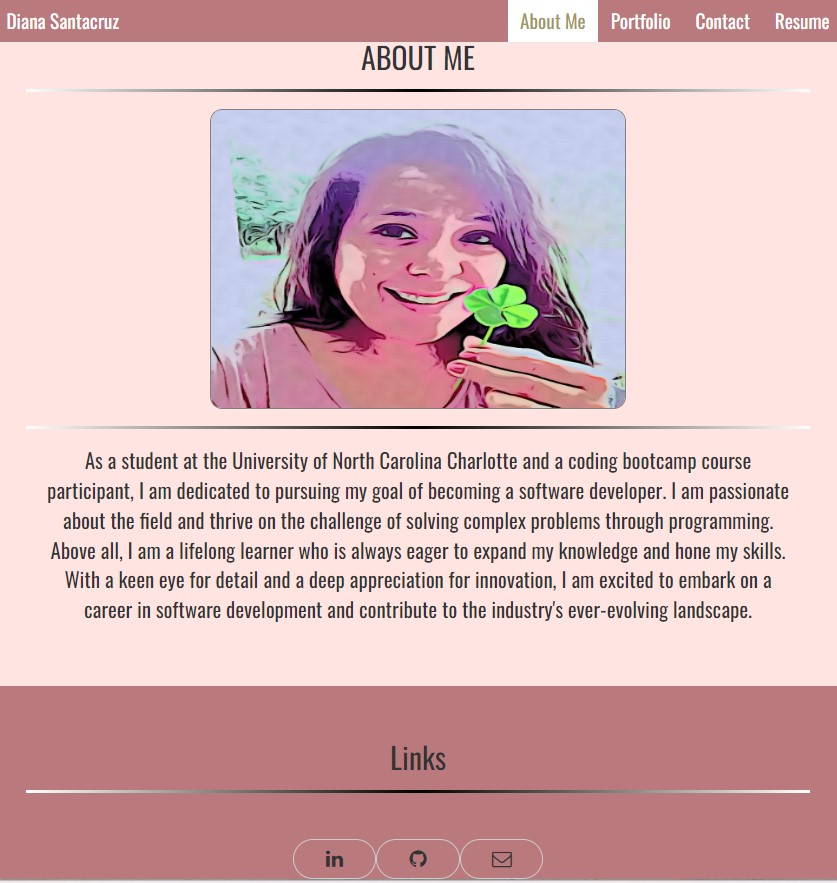
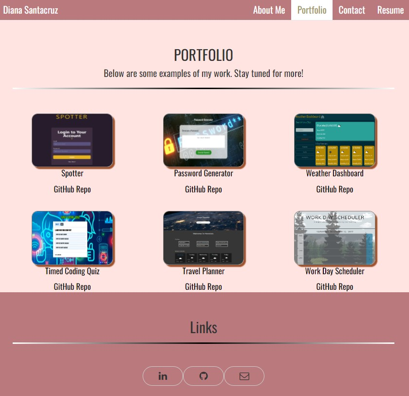
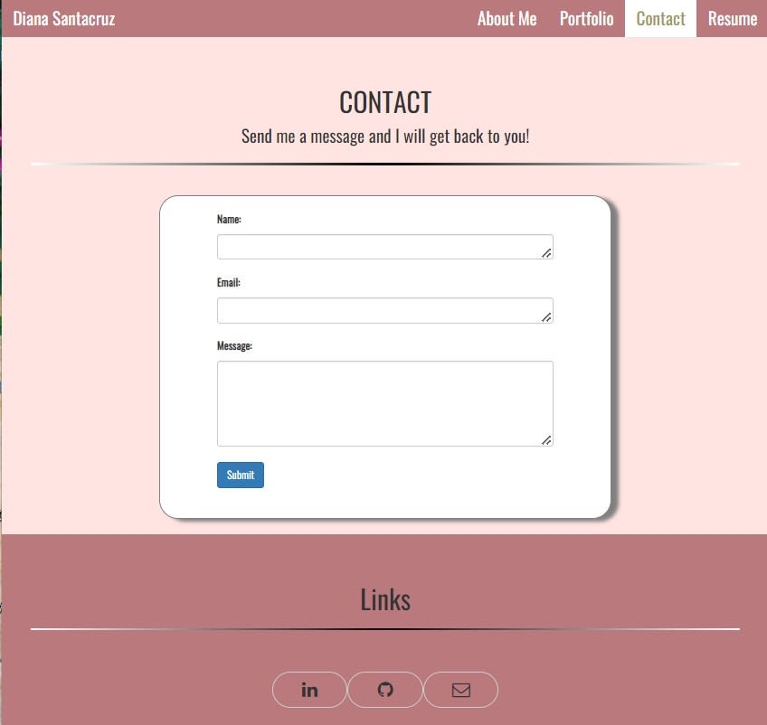
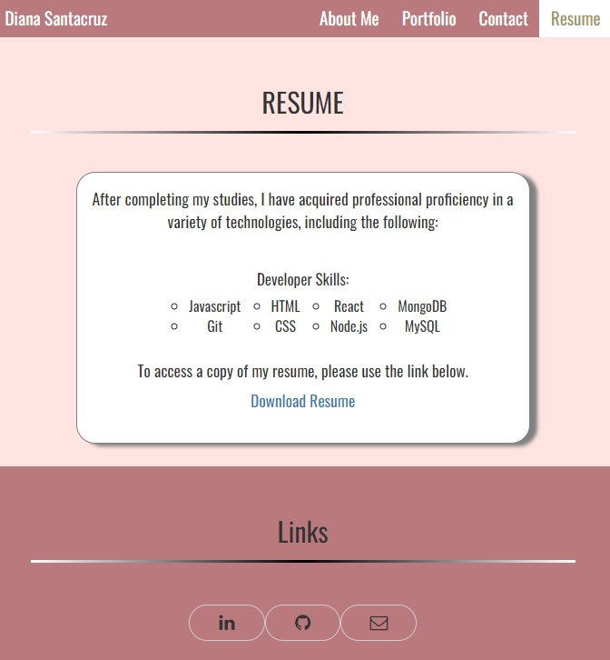

# Diana's Portfolio React Version

## Description
My portfolio of work showcases the skills and talents I have acquired over the course of my education and work experience. Providing my portfolio will give an opportunity for potential employers and peers to look at the knowledge I've acquired and projects and applications I have recently completed.

## Table of Contents

- [Installation](#installation)
- [Usage](#usage)
- [License](#license)
- [Contributing](#contributing)

## Installation
To install my project use the following link: https://github.com/dianavw8/diana-s-portfolio-react-version and follow these simple directions:

Above the list of files, click on the "Code" button.

Copy the URL for the repository.

Open Git Bash.

Change the current working directory to the location where you want the cloned directory.

Type git clone, and then paste the URL you copied earlier.

Press Enter to create your local clone.

For more help and information achiving this, check out the following website: https://docs.github.com/en/repositories/creating-and-managing-repositories/cloning-a-repository

## Usage
The refactored website can be found at: https://dianavw8.github.io/diana-s-portfolio-react-version/#

The following image demonstrates the application's appearance and functionality in the About Me page:

The following image demonstrates the application's appearance and functionality:

The following image demonstrates the application's appearance and functionality:

The following image demonstrates the application's appearance and functionality:

## License

MIT License link: https://github.com/babel/babel/blob/master/LICENSE

## Contributing

The following are contributers to the making of Diana's Portfolio React Version project:

https://shields.io/

https://choosealicense.com/

https://opensource.org/licenses##
