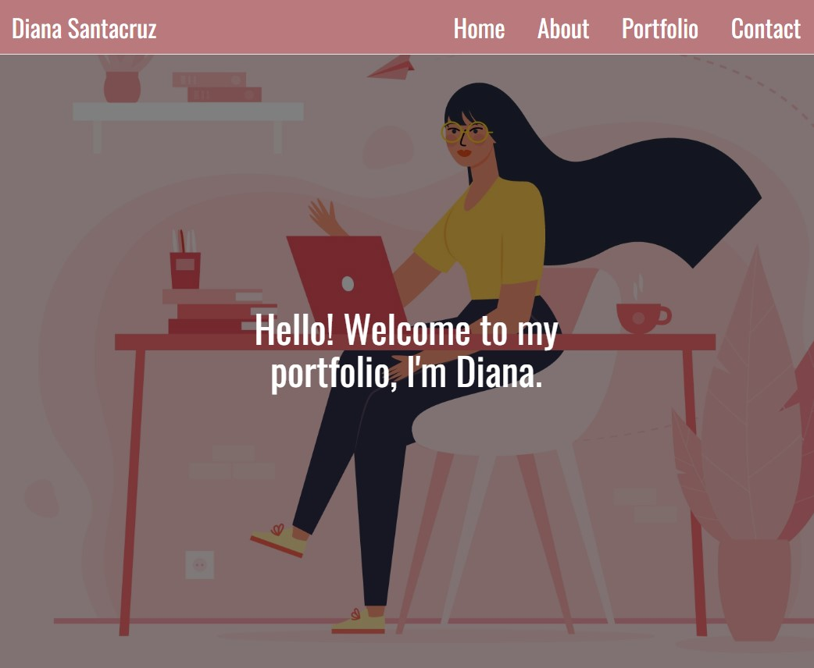

# Diana-s-Portfolio

## Description
My portfolio of work showcases the skills and talents I have acquired over the course of my education and work experience. Providing my portfolio will give an opportunity for potential employers and peers to look at the knowledge I've acquired and projects and applications I have recently completed.

## Purpose
By creating my portfolio, I will set myself up for future success by applying the core skills I've learned. I will continue to grow and improve the appearance of my portfolio as I gain more experience and knowledge.

## Installation
To install my project use the following link: https://dianavw8.github.io/Diana-s-Portfolio/ and follow these simple directions:

Above the list of files, click on the "Code" button.

Copy the URL for the repository.

Open Git Bash.

Change the current working directory to the location where you want the cloned directory.

Type git clone, and then paste the URL you copied earlier.

Press Enter to create your local clone.

For more help and information achiving this, check out the following website: https://docs.github.com/en/repositories/creating-and-managing-repositories/cloning-a-repository

## Usage
The refactored website can be found at: https://dianavw8.github.io/Diana-s-Portfolio/

The following image demonstrates the web application's appearance and functionality:

## Lessons Learned
Throughout this project, I learned the importance of maintain my portfolio updated with new projects and applications completed. I will continue to improve the appearance of the portfolio as I gain more experience and knowledge.

## Credits and Inspiration
https://github.com/dianavw8

https://coding-boot-camp.github.io/full-stack/github/professional-readme-guide

https://docs.github.com/en/repositories/creating-and-managing-repositories/cloning-a-repository
